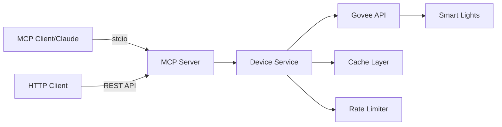

# Govee MCP Server

[](https://opensource.org/licenses/MIT)
[](https://nodejs.org/)
[](https://www.typescriptlang.org/)

A [Model Context Protocol (MCP)](https://modelcontextprotocol.io) server for controlling Govee smart lights. Supports both **stdio** (for MCP clients like Claude Desktop) and **HTTP** modes for flexible integration.

## What is MCP?

The Model Context Protocol (MCP) is an open standard that enables AI assistants to securely connect to external tools and data sources. This server implements MCP to allow AI assistants like Claude to control your Govee smart lights through natural language commands.

**Example:** Simply tell Claude "Turn on my bedroom light" or "Set the living room to warm white" - no code required!

## Table of Contents

- [What is MCP?](#what-is-mcp)
- [Features](#features)
- [Quick Start](#quick-start)
  - [Prerequisites](#prerequisites)
  - [Installation](#installation)
- [Configuration](#configuration)
- [Usage](#usage)
  - [Mode 1: stdio (for MCP Clients)](#mode-1-stdio-for-mcp-clients)
  - [Mode 2: HTTP Server](#mode-2-http-server)
  - [Mode 3: Docker (HTTP Server)](#mode-3-docker-http-server)
- [Available MCP Tools](#available-mcp-tools)
- [MCP Client Configuration](#mcp-client-configuration)
- [How It Works](#how-it-works)
- [Development](#development)
- [Architecture](#architecture)
- [Troubleshooting](#troubleshooting)
- [Contributing](#contributing)
- [Resources](#resources)
- [License](#license)

## Features

- 🔌 **Dual Mode Support** - stdio transport for MCP clients + HTTP API for custom integrations
- 💡 **Full Device Control** - Turn lights on/off, adjust brightness, set RGB colors
- 🔍 **Device Discovery** - List and query available Govee devices
- 🔐 **Authentication** - Secure token-based client authentication
- ⚡ **Rate Limiting** - Per-client request throttling with configurable limits
- 📦 **Smart Caching** - Device state caching to minimize API calls
- 🔄 **Command Coalescing** - Batches rapid commands to prevent API flooding
- 🔁 **Retry with Backoff** - Automatic retries for transient failures
- ✅ **Fully Tested** - Comprehensive test coverage (385+ tests)

## Quick Start

### Prerequisites

- Node.js >= 20.0.0
- A Govee API key ([Get one here](https://developer.govee.com/))
- Govee smart devices registered to your account

### Installation

#### Option 1: From npm (Coming Soon)

```bash
npm install -g govee-mcp-server
```

#### Option 2: From Source

```bash
# Clone the repository
git clone https://github.com/ayushgoel24/govee-mcp-server.git
cd govee-mcp-server

# Install dependencies
npm install

# Build the project
npm run build

# (Optional) Install globally for easier CLI access
npm link
```

After running `npm link`, you can use the `govee-mcp` command from anywhere, and your Claude Desktop config can use `"command": "govee-mcp"` without needing the full path.

## Configuration

### Environment Variables

Configure the server using environment variables. You can set these in a `.env` file or pass them directly:

```bash
# Copy the example environment file
cp .env.example .env
```

#### Required Variables

| Variable | Description |
|----------|-------------|
| `GOVEE_API_KEY` | Your Govee API key from [developer.govee.com](https://developer.govee.com/) |
| `MCP_CLIENT_TOKENS` | Comma-separated list of valid client tokens (HTTP mode only) |

> **Note:** For stdio mode, only `GOVEE_API_KEY` is required. `MCP_CLIENT_TOKENS` is only used for HTTP mode authentication.

### Optional Environment Variables

| Variable | Default | Description |
|----------|---------|-------------|
| `PORT` | `3000` | Server port |
| `HOST` | `0.0.0.0` | Server host |
| `NODE_ENV` | `development` | Environment (`development`, `production`, `test`) |
| `LOG_LEVEL` | `info` | Log level (`debug`, `info`, `warn`, `error`) |
| `DEVICE_CACHE_TTL_MS` | `300000` | Device cache TTL in milliseconds (5 min) |
| `PER_CLIENT_RATE_LIMIT` | `60` | Max requests per client per window |
| `RATE_LIMIT_WINDOW_MS` | `60000` | Rate limit window in milliseconds (1 min) |
| `MAX_RETRIES` | `3` | Max retry attempts for Govee API calls |
| `INITIAL_BACKOFF_MS` | `1000` | Initial retry backoff |
| `MAX_BACKOFF_MS` | `10000` | Maximum retry backoff |
| `COALESCE_WINDOW_MS` | `200` | Command coalescing window |
| `DEFAULT_DEVICE_ID` | - | Default device ID for commands without explicit target |

## Usage

The server can run in two modes:

### Mode 1: stdio (for MCP Clients)

Use this mode to connect with MCP-compatible clients like Claude Desktop, Cline, or other AI assistants.

```bash
# Run with environment variable
GOVEE_API_KEY=your-api-key node dist/stdio.js

# Or use the CLI command (after global install)
GOVEE_API_KEY=your-api-key govee-mcp

# Development mode
GOVEE_API_KEY=your-api-key tsx src/stdio.ts
```

**Test with MCP Inspector:**

```bash
npx @modelcontextprotocol/inspector -e GOVEE_API_KEY=your-api-key node dist/stdio.js
```

### Mode 2: HTTP Server

Use this mode for custom integrations, webhooks, or when you need a REST API.

```bash
# Development mode (with hot reload)
npm run dev

# Production mode
npm run build
npm start
```

The HTTP server starts on `http://localhost:3000` (configurable via `PORT` and `HOST` environment variables).

### Mode 3: Docker (HTTP Server)

Run the HTTP server in a Docker container:

```bash
# Build the Docker image
npm run docker:build

# Run with docker-compose
docker-compose up -d

# Or run directly
docker run -d \
  -p 3000:3000 \
  -e GOVEE_API_KEY=your-api-key \
  -e MCP_CLIENT_TOKENS=your-token \
  govee-mcp-server
```

### HTTP API Endpoints

#### Health Check

```bash
GET /healthz
```

Returns `200 OK` when the server is healthy.

#### List Devices

```bash
GET /devices
Headers:
  x-mcp-auth: <your-client-token>
```

Returns a list of all Govee devices associated with your account.

#### MCP Tool Invocation

```bash
POST /mcp/invoke
Headers:
  x-mcp-auth: <your-client-token>
  Content-Type: application/json

Body:
{
  "tool": "<tool-name>",
  "params": { ... }
}
```

## Available MCP Tools

The server exposes the following tools via the MCP protocol:

| Tool | Description | Parameters |
|------|-------------|------------|
| `list_devices` | List all available Govee devices | None |
| `get_device_state` | Get current state of a device | `deviceId`: Device MAC address |
| `turn_on` | Turn a device on | `deviceId`: Device MAC address |
| `turn_off` | Turn a device off | `deviceId`: Device MAC address |
| `set_brightness` | Set brightness level (1-100) | `deviceId`: Device MAC address<br>`brightness`: Integer 1-100 |
| `set_color` | Set RGB color | `deviceId`: Device MAC address<br>`r`, `g`, `b`: Integers 0-255 |

### Example Usage

#### With MCP Clients (stdio mode)

Simply ask your AI assistant:
- "List my Govee devices"
- "Turn on the bedroom light"
- "Set the living room light to blue"
- "Dim the kitchen light to 50%"

#### With HTTP API

```bash
curl -X POST http://localhost:3000/mcp/invoke \
  -H "Content-Type: application/json" \
  -H "x-mcp-auth: your-token" \
  -d '{
    "tool": "turn_on",
    "params": {
      "deviceId": "AA:BB:CC:DD:EE:FF"
    }
  }'
```

## MCP Client Configuration

### Claude Desktop (stdio mode - Recommended)

> **Quick Setup:**
> 1. Install: `npm install -g govee-mcp-server` (or `npm link` from source)
> 2. Get your Govee API key from [developer.govee.com](https://developer.govee.com/)
> 3. Add the config below to `~/Library/Application Support/Claude/claude_desktop_config.json` (macOS) or `%APPDATA%\Claude\claude_desktop_config.json` (Windows)
> 4. Restart Claude Desktop

Configuration file locations:
- **macOS:** `~/Library/Application Support/Claude/claude_desktop_config.json`
- **Windows:** `%APPDATA%\Claude\claude_desktop_config.json`

#### Option 1: Global Install (Recommended)

After installing globally with `npm install -g govee-mcp-server` or `npm link`:

```json
{
  "mcpServers": {
    "govee": {
      "command": "govee-mcp",
      "env": {
        "GOVEE_API_KEY": "your-govee-api-key"
      }
    }
  }
}
```

#### Option 2: npx (When Published to npm)

```json
{
  "mcpServers": {
    "govee": {
      "command": "npx",
      "args": ["-y", "govee-mcp-server"],
      "env": {
        "GOVEE_API_KEY": "your-govee-api-key"
      }
    }
  }
}
```

#### Option 3: Local Development/Source Install

First, get the absolute path to your installation:

```bash
cd /path/to/govee-mcp-server
pwd  # Copy this path
```

Then use the full path in your config:

```json
{
  "mcpServers": {
    "govee": {
      "command": "node",
      "args": ["/Users/yourusername/projects/govee-mcp-server/dist/stdio.js"],
      "env": {
        "GOVEE_API_KEY": "your-govee-api-key"
      }
    }
  }
}
```

> **Tip:** Replace `/Users/yourusername/projects/govee-mcp-server` with the actual path from the `pwd` command above.

#### Verifying Your Setup

Before configuring Claude Desktop, test that the server works:

```bash
# If installed globally or via npm link:
GOVEE_API_KEY=your-api-key govee-mcp

# If using local path:
GOVEE_API_KEY=your-api-key node /path/to/govee-mcp-server/dist/stdio.js

# Test with MCP Inspector:
npx @modelcontextprotocol/inspector -e GOVEE_API_KEY=your-api-key govee-mcp
```

If the server starts without errors, you're ready to configure Claude Desktop. After updating the config, restart Claude Desktop for the changes to take effect.

### HTTP Mode Integration

For custom integrations using the HTTP API:

```json
{
  "mcpServers": {
    "govee": {
      "url": "http://localhost:3000",
      "headers": {
        "x-mcp-auth": "your-client-token"
      }
    }
  }
}
```

> **Note:** HTTP mode requires starting the server separately with `npm start` and configuring `MCP_CLIENT_TOKENS` in your environment.

## How It Works



1. **MCP Client/HTTP Request** → Your AI assistant or HTTP client sends a tool invocation
2. **Authentication** → Server validates credentials (stdio mode: none required, HTTP mode: token-based)
3. **Rate Limiting** → Request is checked against rate limits
4. **Cache Check** → Device state is checked in cache first
5. **Govee API** → If needed, server calls Govee API with retry logic
6. **Command Coalescing** → Rapid commands are batched to prevent API flooding
7. **Response** → Result is returned to the client

## Development

```bash
# Run tests
npm test

# Run tests with coverage
npm run test:coverage

# Run tests in watch mode
npm run test:watch

# Lint code
npm run lint

# Fix lint issues
npm run lint:fix
```

## Architecture

```
src/
├── clients/        # External API clients (Govee)
├── config/         # Configuration management
├── middleware/     # Fastify middleware (auth, request ID, rate limiting)
├── routes/         # HTTP route handlers
├── schemas/        # Zod validation schemas
├── services/       # Business logic
├── types/          # TypeScript type definitions
└── utils/          # Utilities (cache, queue, retry, errors)
```

## Troubleshooting

### stdio Mode Issues

**MCP client not connecting:**
- Ensure the path to `dist/stdio.js` is absolute
- Verify `GOVEE_API_KEY` is set in the MCP client configuration
- Check Node.js version is >= 20.0.0
- Look for error messages in your MCP client's logs

**"Module not found" errors:**
- Run `npm run build` to compile TypeScript to JavaScript
- Ensure `dist/` directory exists and contains compiled files

### HTTP Mode Issues

**"Authentication required" error:**
- Ensure you're including the `x-mcp-auth` header
- Verify the token matches one in your `MCP_CLIENT_TOKENS` configuration
- Check that `MCP_CLIENT_TOKENS` is properly set in your environment

**"Rate limit exceeded" error:**
- You've exceeded the configured request rate
- Wait for the rate limit window to reset
- Increase `PER_CLIENT_RATE_LIMIT` if needed

### Device Issues

**Device not found:**
1. Verify the device ID is correct (MAC address format: `AA:BB:CC:DD:EE:FF`)
2. Ensure the device is registered to the Govee account associated with your API key
3. Try refreshing the device cache by restarting the server
4. Test the Govee API key directly at [developer.govee.com](https://developer.govee.com/)

**Commands not working:**
- Check if the device supports the command (not all devices support all features)
- Ensure the device is online and connected to WiFi
- Try controlling the device via the official Govee app first

### Govee API Issues

**429 Rate Limit errors:**
- The Govee API has its own rate limits (separate from this server's limits)
- The server will automatically retry with exponential backoff
- Consider increasing `COALESCE_WINDOW_MS` to batch commands

**Invalid API key:**
- Verify your API key at [developer.govee.com](https://developer.govee.com/)
- Ensure there are no extra spaces or newlines in the key
- Check if the key has expired or been revoked

## Contributing

Contributions are welcome! Please feel free to submit a Pull Request. For major changes, please open an issue first to discuss what you would like to change.

1. Fork the repository
2. Create your feature branch (`git checkout -b feature/amazing-feature`)
3. Commit your changes (`git commit -m 'Add some amazing feature'`)
4. Push to the branch (`git push origin feature/amazing-feature`)
5. Open a Pull Request

Please ensure:
- All tests pass (`npm test`)
- Code follows the linting rules (`npm run lint`)
- You've added tests for new features

## Resources

- [Model Context Protocol Documentation](https://modelcontextprotocol.io)
- [Govee Developer API](https://developer.govee.com/)
- [MCP TypeScript SDK](https://github.com/modelcontextprotocol/typescript-sdk)
- [Claude Desktop](https://claude.ai/download)

## Support

- **Issues:** [GitHub Issues](https://github.com/ayushgoel24/govee-mcp-server/issues)
- **Discussions:** [GitHub Discussions](https://github.com/ayushgoel24/govee-mcp-server/discussions)

## License

MIT License - see [LICENSE](LICENSE) file for details.

## Acknowledgments

- Built with the [Model Context Protocol SDK](https://github.com/modelcontextprotocol/typescript-sdk)
- Powered by [Govee Developer API](https://developer.govee.com/)
- Uses [Fastify](https://www.fastify.io/) for HTTP mode
